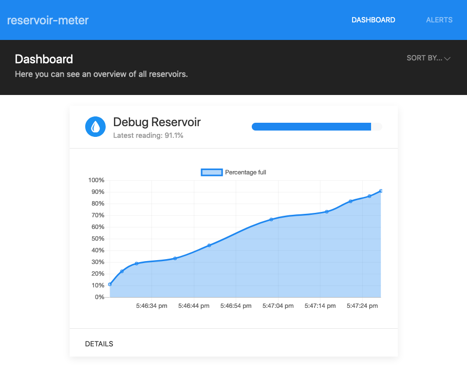

# reservoir-meter
Small project for Embedded Systems class. Allows you to monitor the water level of multiple reservoirs through a webapp.

Has a couple parts:

### Webapp

(todo: explanation here)

### Node MCU (ESP8266)

(todo: explanation here)

## Instructions
- Redis:
    - Set up a new redis instance.
    - Change relevant configurations in `db.js` so the app can connect to it.
- Node Webapp:
    - Install dependencies: `npm install`
    - Start dev server: `npm start`
    - The application should now be available at `localhost:3000`.
- ESP8266:
    - Configure the Arduino IDE to support the ESP8266 board.
    - Load up the `esp8266` folder in the Arduino IDE, change whatever's necessary (WiFi AP name and password, webapp server IP address, input/output pin numbers...) in `main.c`.
    - Write sketch to the board.
